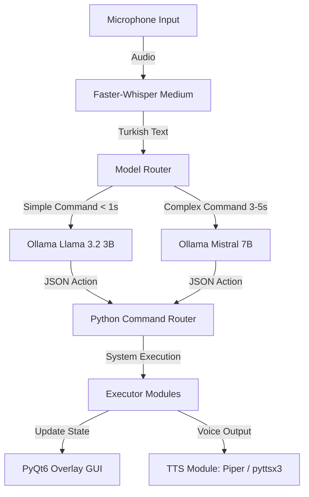

# JARVIS — Personal Local AI Desktop Assistant

<p align="center">
  
</p>

JARVIS is a fully offline, high-performance, and privacy-first local AI Desktop Assistant designed specifically for Windows 11. It combines state-of-the-art **Speech-to-Text (Faster-Whisper)**, **Local LLMs (via Ollama)**, and **Offline Text-to-Speech (Piper / pyttsx3)** with a transparent overlay PyQt6 desktop UI to offer full-fledged voice control, system administration, and automation.

---

## 🌟 Key Features

- **100% Local & Private**: No cloud APIs, no subscription fees, and no internet connection required. Your voice and data never leave your PC.
- **Intelligent Model Router**: Dynamically swaps and runs LLMs based on task complexity (uses Llama 3.2 3B for sub-second system commands and Mistral 7B for complex coding, prompt engineering, and file summaries).
- **Voice-First Navigation**: Whisper-powered speech recognition optimized for Turkish, with automatic fallback and silent wake/sleep modes.
- **Rich Module Integration**:
  - 🖥️ **System Management**: Open/close apps (Spotify, CS2, etc.), manage volume, shutdown, or restart (with safety confirmation).
  - 🐙 **Git Automation**: Full repository management using voice commands (`git status`, `git pull`, automated commit message generation with Mistral, and safe `force push` controls).
  - 🚀 **IDE & Prompt Utility**: Create new projects, launch IDEs, and generate pre-optimized engineering prompts for Cursor or Windsurf.
  - 🐚 **Terminal Automator**: Update pip packages, initialize virtual environments, or run custom terminal tasks.
  - 📁 **File & Document Assistant**: Automatically organize folders, clean directory clutter, or generate summaries of PDF files.
  - 🎵 **Media & Web Control**: Play/pause/skip Spotify tracks, adjust system volume, and search the web using Opera or standard browsers.
- **Active Context Awareness**: Automatically tracks your active Windows application and focus directory, understanding contextual voice commands like *"Upload this project to GitHub"* natively.
- **Persistent Memory & Logging**: SQLite database retains activity history to power context-recall commands, paired with low-overhead 30-day rotating logs.

---

## ⚙️ System Architecture



---

## 🧠 Model Routing & Decision Logic

To maintain optimal CPU/GPU usage on standard desktop setups (e.g., 6GB VRAM GPUs like the RTX 3060), JARVIS employs a smart **Model Router** that manages Ollama model loading.

| Command Complexity | Model Used | Typical Response Time | Example Command |
| :--- | :--- | :--- | :--- |
| **Simple Actions** | Llama 3.2 (3B) | **~1.0 second** | *"Open Spotify"* / *"Set volume to 50%"* / *"Git Pull"* |
| **Complex Tasks** | Mistral (7B) | **~3.0 - 5.0 seconds** | *"Summarize this PDF"* / *"Generate prompt for Cursor"* |

*Note: Models are loaded and freed dynamically. Both models do not sit in RAM simultaneously, keeping hardware VRAM clear for gaming or heavy development work.*

---

## 📁 Repository Structure

```
jarvis/
├── core/
│   ├── brain.py          # Ollama LLM integration
│   ├── context.py        # Active window and focus context tracking
│   ├── listener.py       # Whisper speech recognition pipeline
│   ├── memory.py         # SQLite memory database interface
│   ├── router.py         # Model selector & module director
│   ├── safety.py         # Multi-step safety voice-confirmation system
│   └── tts.py            # Offline Piper / pyttsx3 TTS engine
├── modules/
│   ├── app_manager.py    # Application launching and shutdown
│   ├── browser_manager.py# Desktop browser and navigation control
│   ├── daily_summary.py  # Startup briefings (commits, files, status)
│   ├── file_manager.py   # File system organizers & PDF summarizers
│   ├── free_chat.py      # Conversational LLM chat module
│   ├── git_manager.py    # Local Git automation commands
│   ├── media_manager.py  # Keyboard hotkeys and music controllers
│   ├── prompt_generator.py# Cursor/Windsurf AI code generation prompts
│   └── terminal_manager.py# Virtual environment and shell executors
├── ui/
│   └── window.py         # Transparent, stateful PyQt6 overlay GUI
├── tests/                # Test suite for modular integration tests
│   ├── __init__.py
│   └── test_*.py         # (14 specific test scripts)
├── data/                 # Ignored SQLite storage & logs
├── setup_jarvis.ps1      # Creates desktop shortcut & configures Startup
├── setup_scheduler.ps1  # Silently schedules launch with elevated privileges
├── start_jarvis.bat      # Startup execution script
├── config.py             # Global variables, models, and path definitions
├── requirements.txt      # Python dependencies
└── README.md             # Project documentation (this file)
```

---

## 🚀 Installation & Setup

Follow these steps to set up JARVIS on your Windows 11 machine:

### Step 1: Install Ollama & Pull Models
1. Download and install **Ollama** from the official website: [ollama.com](https://ollama.com).
2. Open your terminal (PowerShell or Command Prompt) and pull the necessary models:
   ```powershell
   ollama pull llama3.2:3b
   ollama pull mistral:7b
   ```

### Step 2: Set Up Python Environment
Clone the repository and set up a Python virtual environment:
```powershell
# Create a virtual environment
python -m venv venv
venv\Scripts\activate

# Install the dependencies
pip install -r requirements.txt
```

### Step 3: Configure Settings
Open `config.py` in your editor and configure the execution variables, paths, and application shortcuts:
```python
APPS = {
    "cs2": "C:/Program Files (x86)/Steam/steamapps/common/Counter-Strike Global Offensive/game/bin/win64/cs2.exe",
    "spotify": "C:/Users/[YourUser]/AppData/Roaming/Spotify/Spotify.exe",
    "opera": "C:/Users/[YourUser]/AppData/Local/Programs/Opera/launcher.exe",
    "cursor": "C:/Users/[YourUser]/AppData/Local/Programs/cursor/Cursor.exe",
}

DEFAULT_GIT_PATH = "C:/Users/[YourUser]/Projects"
WHISPER_LANGUAGE = "tr"
WHISPER_MODEL = "medium"
SLEEP_TIMEOUT_MINUTES = 10
LOG_RETENTION_DAYS = 30
```

### Step 4: Run Windows Integration Scripts
To automate launching JARVIS on Startup, run the provided scripts with elevated Administrator permissions:

1. **Local Shortcut & Icon Generation:**
   ```powershell
   .\setup_jarvis.ps1
   ```
   *This converts the PNG assets, builds a dedicated `jarvis.ico`, adds an admin-level Desktop Shortcut, and copies the launch script to the Windows Startup folder.*

2. **Silently Schedule Task (UAC Bypass):**
   ```powershell
   .\setup_scheduler.ps1
   ```
   *This registers a Task Scheduler entry to start JARVIS completely silently in minimized mode immediately at login, bypassing Windows User Account Control (UAC) prompts.*

---

## 🖥️ Usage Guide

Run JARVIS by clicking the Desktop shortcut, or run it directly from your activated virtual environment:
```powershell
python main.py
```

### Desktop Overlay UI States:
- 🔵 **Blue (Listening...)**: JARVIS is active and waiting for a voice command.
- 🟡 **Yellow (Processing...)**: Voice command is captured and the Ollama model is thinking.
- 🟢 **Green (Success)**: The command has successfully completed.
- 🔴 **Red (Error)**: There was a system error or command mismatch.

### Voice Examples (Turkish):
- *"Spotify'ı aç"* (Opens Spotify)
- *"Projeyi GitHub'a yükle"* (Automatically adds, commits, and pushes modified files)
- *"CS2'yi aç"* (Launches Counter-Strike 2)
- *"Bilgisayarı kapat"* (System will ask *"Emin misiniz?"* -> respond *"Evet"* to trigger shutdown)
- *"Cursor için prompt üret"* (Mistral generates pre-formatted context prompts for code analysis)

---

## ⚠️ Limitations & Disclaimers

- **Voice Commands**: The core model is fine-tuned to receive Turkish voice inputs, but system instructions are formatted in English inside the LLM prompt to ensure the highest JSON accuracy.
- **Active Writing**: JARVIS cannot type directly into other active application windows (like the AI prompt input of Cursor/Windsurf). It generates prompts and places them on your clipboard or displays them in a popup window for you to copy and paste.
- **Local TTS Fallback**: When high-quality Piper models are absent, the application gracefully drops back to native `pyttsx3` voices.

---

## 📄 License
This project is open-source and available under the MIT License.
